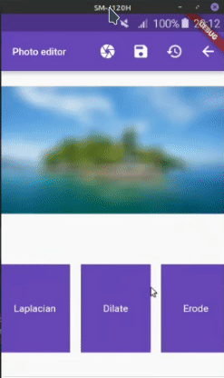

# Photo Editor com OpenCV (Editor de fotos com OpenCV)

## 📖 Descrição

Esse projeto se refere a um editor de fotos que utiliza filtros de visão computacional. A visão computacional é uma área da inteligência artificial que permite aos computadores “verem” e interpretarem imagens digitais de maneira semelhante à visão humana. 

## 🛠️ Funcionalidades

- Aplicar filtros de visão computacional (Blur, 2DFilter, MedianBlur, GaussianBlur, Sobel, Laplacian, Dilate, Erode) em imagens;
- Cortar imagens;
- Rotacionar imagens;
- Salvar a imagem editada.

## 📡 Tecnologias utilizadas

 

  

  

## ⏳ Inicialização

Esse projeto foi desenvolvido usando o framework de desenvolvimento mobile [Flutter](https://flutter.dev/). Para uso de filtros de visão computacional com OpenCv foi utilizada uma biblioteca externa que está disponível no [link](https://pub.dev/packages/opencv).

## 🤵🤵‍♀️ Colaboradores

O único colaborador desse projeto fui eu (Eduardo Vítor).

 

## 🔎 Status do Projeto

 

## 📑 Referências

[Flutter](https://flutter.dev/)

[Lib OpenCV](https://pub.dev/packages/opencv)

